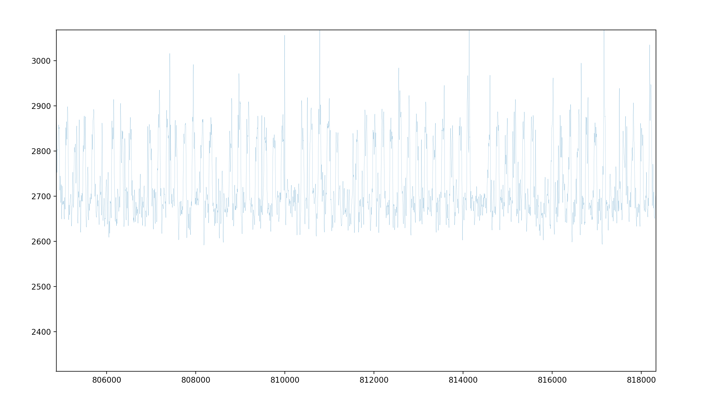
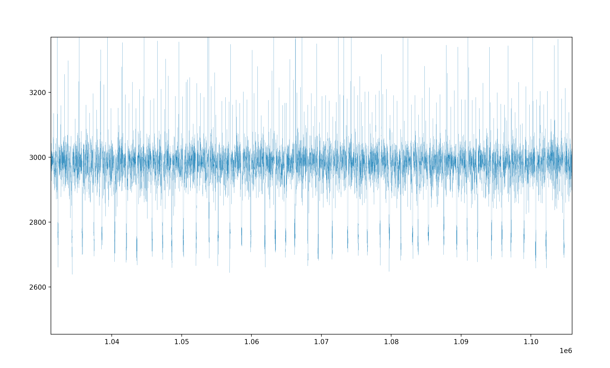

# L2-LLC Evict Probe

### How to use cat to isolate LLC
For example, if victim runs on core 7, this two commands will isolate core 7's LLC:
```
sudo pqos -e "llc:1=0x0001;llc:2=0x07fe;"
sudo pqos -a "llc:1=7;llc:2=0-6,8-24;"
```
Core 7 will use 1 way and other core will use the other ways.

And this command could show the status:
```
sudo pqos -s
```

### Usage
We need 2G hugepage firstly. I allocate them like this:
```
mkdir -p /mnt/huge_2mb
mount -t hugetlbfs none /mnt/huge_2mb -o pagesize=2MB
su
echo 1024 > /sys/kernel/mm/hugepages/hugepages-2048kB/nr_hugepages
```

##### Find enough Cacheline addresses for each LLC slice
```
make
./calc_map 
```
##### Run Java RSA target
```
cd RSA-Target-JVM
./run.sh 7
```

##### Run Out Probe, and you could change the attack list
Open another terminal and run the Attack.py before target ends.
```
sudo ./Attack.py
```

##### Use show_logs.py to display the logs
```
cd Inference
python3 show_logs.py rsa_multiply_keys/time_line_1.log
python3 show_logs.py rsa_square_keys/time_line_0.log
```
The *Square* and *Multiply* patterns could be found at a possibility. By smooth the log, we could distinguish the Squares and Multiplies easily. The given two examples are collected by Xeon 8260, with target list: cha 2<->cha 5, cha 5<->cha 2. The target was binded to core 7. 
The Squares may be look like this, one hump indicates a square:


The Multiples may be look like this, one pit indicates a multiply:
