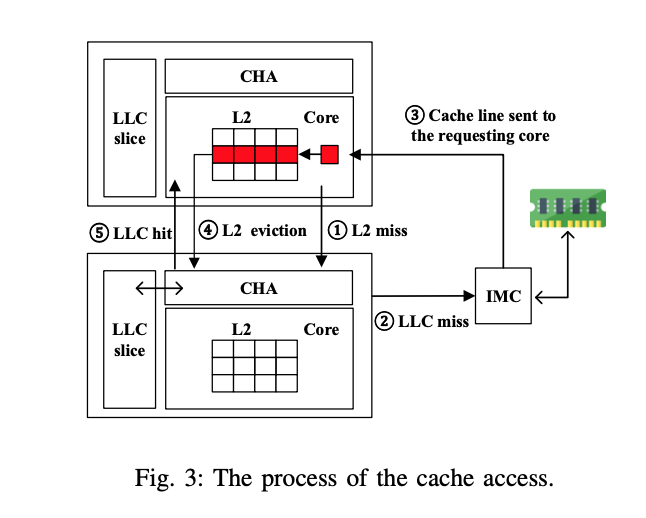
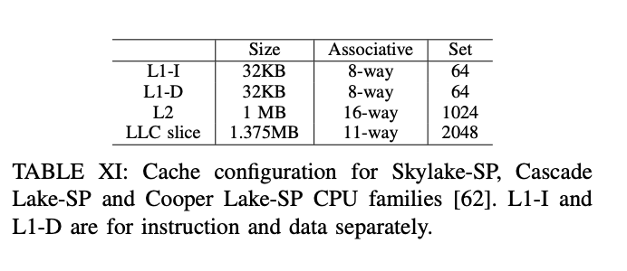
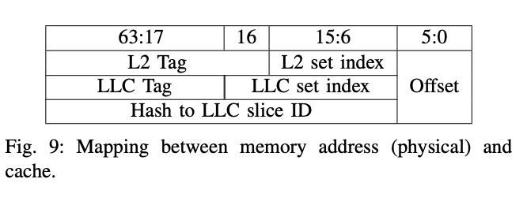

# MeshUp: Stateless Cache Side-channel Attack on CPU Mesh

## Introduction
This is the source code of our paper
[MeshUp: Stateless Cache Side-channel Attack on CPU Mesh](https://www.computer.org/csdl/proceedings-article/sp/2022/131600b396/1A4Q4hofHe8), which will be presented on [IEEE S&P 2022](https://www.ieee-security.org/TC/SP2022/).

## Mesh NOC Reverse Engineering
Our cross-core experiment envrionment is [Intel Xeon 8260](https://ark.intel.com/content/www/us/en/ark/products/192474/intel-xeon-platinum-8260-processor-35-75m-cache-2-40-ghz.html), which is a 28-tile CPU chip with 4 tile disabled. 

The layout is as following:

| UPI |PCIE|PCIE|RLINK|UPI2|PCIE|
|--|--|--|--|--|--|
|0|4|9|14|19|24|
|IMC0|5|10|15|20|IMC1|
|1|6|11|16|21|25|
|2|7|12|17|22|26|
|3|8|13|18|23|27|

Firstly, we should confirm which 4 cores are disabled. We are able to do that by reading msr register CAPID6, like this:
```
> sudo setpci -s 16:1e.3 0x9c.l
07dffff3
```
Then CPAID6[27:0] is 0x7dffff3(0111, 1101, 1111, 1111, 1111, 1111, 0011), we could learn that the disabled tiles' ID are 2, 3, 21, and 27.

By the way, the ID of tiles and CHAs are growing from top to down and left to right. As a result, CHA 2 is in tile 4. In this way, we could map the CHA ID with tile ID for all CHAs, like this:
| UPI |PCIE|PCIE|RLINK|UPI2|PCIE|
|--|--|--|--|--|--|
|0|2|7|12|17|21|
|IMC0|3|8|13|18|IMC1|
|1|4|9|14|X|22|
|X|5|10|15|19|23|
|X|6|11|16|20|X|

We also need the relationships between core ID(core ID is the physical core ID in OS) and CHA ID. This information could be got by a PMU event - LCORE_PMA GV (Core Power Management Agent Global system state Value). Firstly, we bind a process to a core(ID=X), and do a lot of operations with that process(e.g. access a large volume of memory.) At the same time, we monitor the LCORE_PMA GV counter of every CHA. We could observe that the counter on one CHA(ID=Y) is higher than others. So we can confirm that core X and CHA Y lay on the same tile because the activities of core X could change the power management state of CHA Y. Repete the above procedure from core 0 to core 23, we could learn the mappings between core and CHA as the following picture shows:
| UPI |PCIE|PCIE|RLINK|UPI2|PCIE|
|--|--|--|--|--|--|
|0,0|2,16|7,19|12,3|17,16|21,17|
|IMC0|3,18|8,2|13,15|18,10|IMC1|
|1,12|4,1|9,14|14,9|X|22,11|
|X|5,13|10,8|15,21|19,22|23,23|
|X|6,7|11,20|16,4|20,5|X|

Code is [here](./MeshReverseEngineering/).

[Where did we find the configurations?](./Configurations.md)

## Cross-Core Attack
### L2-LLC evict probe

As the picture shows, LLC is non-inclusive by cores, while L1/L2 is inclusive by cores. So, a core on CPU could use access LLC slices from any tiles. LLC is managed by CHA on the tile, and a hash algorithm could determine the corresponding CHA ID which manages a specific Cacheline. By the way, the input of this hash algorithm is bit 6 to bit 64 of the physical memory.


We devise an evict-based method L2-evict to make the memory access flow, which is similar to the concurrent work [Lord of Ring](https://arxiv.org/abs/2103.03443). Suppose we want to congest the interconnect between core R and CHA T. Firstly, we will find an EV(eviction set) set. Cachelines in one EV set will be in a set of core R's L2 cache and will be managed by CHA T. To find the EV set of a specific LLC slice, we use *check_conflict* and *find_EV* functons in [Attack Directory](https://ieeexplore.ieee.org/stamp/stamp.jsp?tp=&arnumber=8835325&tag=1). Such information could also be obtained by PMU events. And to get cachelines in one specific L2 cache set, we use bit 6-bit 15 of physical memory. 

If we access the cachelines in the above EV set, cachelines will be evicted from L2 to LLC and then reload from LLC to L2 (The L2's evict policy is pseudo-LRU). In our machine, an L2 set has 16 ways, and an LLC set has 11 ways. To avoid the situation that cachelines in LLC are evicted to memory which will introduce a higher delay, we will make half of bit 16 of EV's cachelines to 0 and the other to 1. In this way, EV will be evicted to 2 LLC sets. According to our test, setting the number of cachelines in EV to 24 could maximize the congestion of the mesh interconnect.



Code is [here](./L2-LLC_evict_probe/).
### RSA target
TBD
### Analysis
TBD
## Cross-CPU Attack
[Here](https://github.com/GlareR/MeshUp) is the cross-CPU attack details upon UPI.
